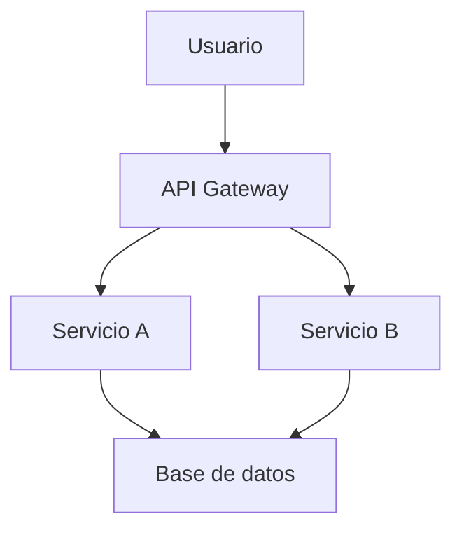

# 📝 Estándares de Documentación

> **Versión:** 1.0.0 | **Aplica a:** Todos los repositorios del ecosistema

---

## 1. Principios de Documentación

La documentación debe ser:

- **Actualizada** — Sincronizada con el código
- **Útil** — Proporciona valor real, no es boilerplate
- **Accesible** — Comprensible para el público objetivo
- **Mantenible** — Fácil de actualizar cuando cambia el código

---

## 2. Estructura de Documentación Obligatoria

Todo repositorio vinculado debe incluir:

### 2.1 README.md (obligatorio)

```markdown
# Nombre del Proyecto

Descripción de una línea.

## Descripción
[2-3 párrafos describiendo el proyecto]

## Requisitos previos
[Dependencias y versiones requeridas]

## Instalación
[Pasos de instalación]

## Uso rápido
[Ejemplo de uso básico]

## Configuración
[Variables de entorno y opciones de configuración]

## Desarrollo
[Cómo contribuir, ejecutar tests, etc.]

## Arquitectura
[Descripción de alto nivel o enlace a docs/architecture.md]

## Source of Truth
Este repositorio se rige por los estándares del
[Source of Truth v1.0.0](https://github.com/senarzuniga/Source-of-Truth).

## Licencia
[Licencia del proyecto]
```

### 2.2 CHANGELOG.md (obligatorio)

Seguir el formato [Keep a Changelog](https://keepachangelog.com):

```markdown
# Changelog

All notable changes to this project will be documented in this file.

## [Unreleased]

## [1.0.0] - 2026-04-08
### Added
- Initial release

[Unreleased]: https://github.com/org/repo/compare/v1.0.0...HEAD
[1.0.0]: https://github.com/org/repo/releases/tag/v1.0.0
```

### 2.3 CONTRIBUTING.md (recomendado)

Guía para contribuidores que incluya:
- Cómo reportar bugs
- Cómo proponer features
- Proceso de desarrollo
- Estándares de código y tests
- Proceso de revisión de PRs

### 2.4 docs/ (si aplica)

Para proyectos complejos:
- `docs/architecture.md` — Diagramas y decisiones arquitectónicas
- `docs/api.md` — Referencia de API
- `docs/runbook.md` — Operaciones y troubleshooting

---

## 3. Documentación de Código

### 3.1 Funciones y métodos

**Cuándo documentar:**
- Funciones públicas en APIs o librerías: siempre
- Funciones privadas complejas: cuando el código no es autoexplicativo
- Funciones simples: comentario NO requerido si el nombre es descriptivo

**Formato por lenguaje:**

Python (Google style docstrings):
```python
def process_hypothesis(hypothesis: Hypothesis, context: Context) -> ValidationResult:
    """Validates a single hypothesis against available evidence.

    Args:
        hypothesis: The hypothesis to validate.
        context: The current evaluation context with available data.

    Returns:
        A ValidationResult with score and evidence summary.

    Raises:
        ValidationError: If the hypothesis format is invalid.
    """
```

TypeScript (JSDoc):
```typescript
/**
 * Validates a single hypothesis against available evidence.
 *
 * @param hypothesis - The hypothesis to validate
 * @param context - The current evaluation context
 * @returns A ValidationResult with score and evidence summary
 * @throws {ValidationError} If the hypothesis format is invalid
 */
function processHypothesis(
  hypothesis: Hypothesis,
  context: Context
): ValidationResult {
```

Go:
```go
// ProcessHypothesis validates a single hypothesis against available evidence.
// It returns a ValidationResult with score and evidence summary,
// or an error if the hypothesis format is invalid.
func ProcessHypothesis(hypothesis Hypothesis, ctx Context) (ValidationResult, error) {
```

### 3.2 Comentarios en línea

```python
# BIEN: Explica el POR QUÉ, no el QUÉ
# Using exponential backoff to avoid overwhelming the API on retries
time.sleep(2 ** retry_count)

# MAL: Repite lo que el código ya dice
# Increment retry count
retry_count += 1
```

---

## 4. Documentación de Arquitectura

### 4.1 Architecture Decision Records (ADR)

Documenta decisiones arquitectónicas significativas en `docs/adr/`:

```markdown
# ADR-001: Usar PostgreSQL como base de datos principal

## Estado
Aceptado

## Contexto
Necesitamos una base de datos que soporte...

## Decisión
Usaremos PostgreSQL porque...

## Consecuencias
- Positivas: ...
- Negativas: ...
- Riesgos: ...
```

### 4.2 Diagramas

- Usar [Mermaid](https://mermaid.js.org/) para diagramas en Markdown
- Incluir diagramas de: arquitectura, flujo de datos, secuencia de APIs
- Los diagramas deben estar en el repositorio (no en herramientas externas)



---

## 5. Documentación de APIs

### 5.1 OpenAPI / Swagger

Las APIs REST deben tener documentación OpenAPI 3.0:

```yaml
openapi: "3.0.0"
info:
  title: "API Name"
  version: "1.0.0"
  description: "Descripción clara de la API"
paths:
  /endpoint:
    get:
      summary: "Resumen de la operación"
      description: "Descripción detallada"
      parameters: []
      responses:
        "200":
          description: "Respuesta exitosa"
```

### 5.2 Endpoints

Cada endpoint debe documentar:
- Propósito y uso
- Parámetros (tipo, requerido/opcional, ejemplo)
- Respuestas exitosas con ejemplos
- Errores posibles con códigos y mensajes
- Autenticación requerida

---

## 6. Calidad de Documentación

El pipeline verifica automáticamente:

```yaml
documentation_checks:
  - name: "README exists"
    check: "file_exists"
    path: "README.md"
    severity: "error"

  - name: "README has required sections"
    check: "contains_headers"
    path: "README.md"
    required_headers:
      - "Descripción"
      - "Instalación"
      - "Uso"
    severity: "warning"

  - name: "CHANGELOG exists"
    check: "file_exists"
    path: "CHANGELOG.md"
    severity: "warning"

  - name: "Source of Truth reference"
    check: "contains_text"
    path: "README.md"
    text: "Source of Truth"
    severity: "warning"

  - name: "No broken links"
    check: "markdown_links_valid"
    paths: ["**/*.md"]
    severity: "warning"
```

---

## 7. Mantenimiento de Documentación

- La documentación debe actualizarse en el mismo PR que el cambio de código
- PRs que cambian APIs o comportamientos sin actualizar docs son rechazados
- Revisar la documentación trimestralmente para detectar inconsistencias
- El Agente Auditor detecta documentación desactualizada automáticamente
